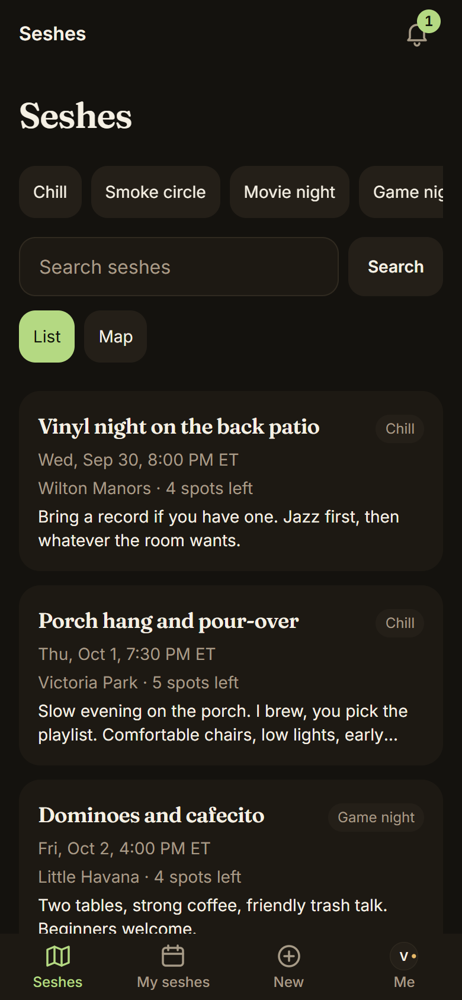
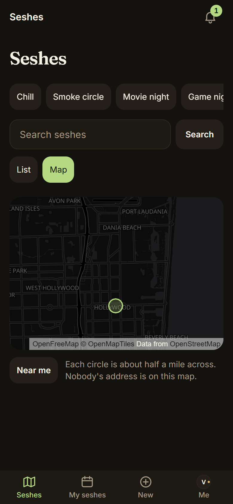
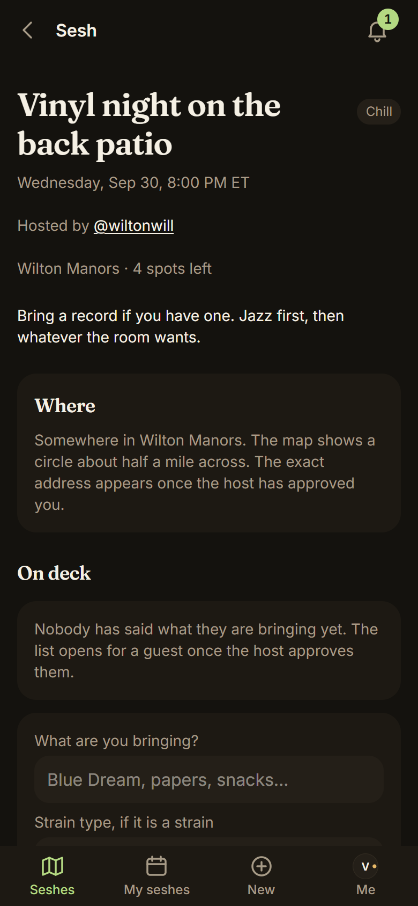

<p align="center"></p>

<p align="center">
  
  
  
  
</p>

**A private social app for verified Florida medical cannabis patients to host and join small gatherings at private residences.**

[Live site](https://meet4weed.vercel.app) · press Try the demo

## Status

| | |
|---|---|
| Phase | Rebuild. Plans 01 to 05 done. Plan 06 (safety) in progress. |
| Shipped | Sign-in, card verification with owner review, seshes, map, RSVPs, address unlock, invites, notifications, installable app, Block. |
| Next | Plan 06, step 3 of 7: report a member or a sesh (#113). Parent: #110. |
| Updated | 2026-09-29 |

## Screenshots

<p align="center">
  
  
  
</p>

## What it does

- Lets a member hold a valid, unexpired OMMU card, checked by a person, not by AI.
- Reads the card with Claude, which lists readings and concerns. An owner approves.
- Lets members post seshes, browse a feed and a map, and RSVP.
- Shows a fuzzy circle on the map. The street address unlocks only for people the host lets in.
- Supports a bring list, unlisted seshes, and invite links.
- Sends discreet push and email notifications. Installs as an app.
- Lets a member block another member.
- Offers a one-press demo with an invented cast.

## What it never does

- **It never helps anyone buy or sell.** No cart, no payments, no dispensary ordering.
- **AI never approves a member.** A person does.
- **Card and face photos do not stay.** They are deleted on the reviewer's decision, and after 7 days at most.
- **Push text names nobody.**

## Stack

Next.js 16.3 (App Router), React 19, TypeScript, Tailwind v4. Supabase Postgres, Auth and row-level security. Claude for card reading. Upstash, Resend, Vercel. Full table: [docs/ARCHITECTURE.md](docs/ARCHITECTURE.md).

## Run it locally

You need Node 22+ and access to the hosted Supabase project. There is no Docker and no local database.

```bash
npm install
cp .env.example .env.local
npm run dev
```

Fill in `.env.local`. `.env.example` names every variable and says where it comes from. Open `http://localhost:3000`. Every step, env variable, and script is in [docs/SETUP.md](docs/SETUP.md).

## Tests

```bash
npm run test:unit
npm run test:integration
```

Never `npm test`. It prints an error on purpose. CI runs typecheck, `test:unit` and the build. The database tests skip in CI, so run `test:integration` before merging a migration. Detail: [docs/TESTING.md](docs/TESTING.md).

## Docs

- [Spec](docs/superpowers/specs/2026-09-16-meet4weed-rebuild-design.md)
- [Plan index](docs/PLANS.md) and [build status](docs/BUILD-STATUS.md)
- [Setup, scripts, database](docs/SETUP.md)
- [Architecture, invites, demo](docs/ARCHITECTURE.md)
- [Tests](docs/TESTING.md)
- [DESIGN.md](DESIGN.md), [PRODUCT.md](PRODUCT.md), [CONTEXT.md](CONTEXT.md)
- [ADRs](docs/adr/)

---

<p align="center"><sub>Built by <a href="https://tekguyz.com">TEKGUYZ</a></sub></p>
